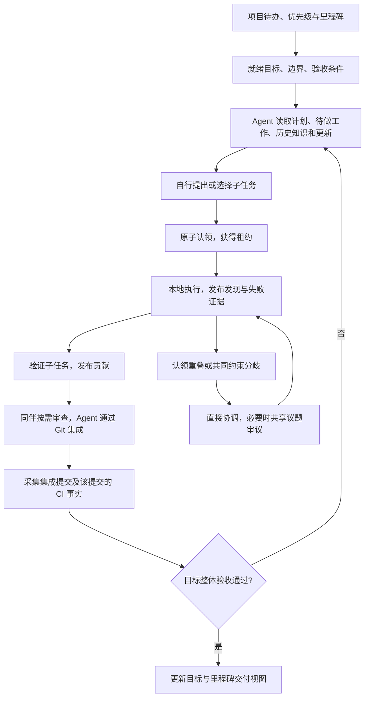

# Preflight 项目管理与自主协作改造方案 v0.2

日期：2026-10-08。方案基线：`bb8c85d`。实施状态：阶段 A 已实现首版（项目规划、任务/依赖、主责任租约、历史知识检索）；阶段 B/C 尚未实现。当前协议与限制见[开发说明第 13 节](../development-guide.md#13-阶段-a项目管理与任务认领)。本方案描述完整 v0.2，不能将全部设计视为已交付；容量限制、标签/全文搜索、独立目标验收与交付仍待后续。

## 1. 目标与判断

Preflight 为替代传统 devboard 而生，产品主线是项目管理：管理需求、目标、任务、优先级、依赖、里程碑、进展与交付。建议借鉴 Agensh 的自主协作循环、共享知识和可靠事件机制作为执行内核，在现有 MCP 服务上增量实现。

下一版的产品目标：团队在 Preflight 中维护项目方向和交付计划，用户给出目标、优先级、边界和验收条件，至少两个平等的 Agent 自己发现并认领工作，通过共享记录协调，完成验证与集成，再判断下一步。管理者能回答“要做什么、先做什么、谁负责、做到哪里、为什么卡住、影响哪个里程碑、什么已交付”。Agent 自动维护执行信息，不要求用户持续分派、催办或确认普通技术取舍。

项目管理功能与自主协作内核共同构成 v0.2 的 MVP。管理界面和管理 MCP 入口从阶段 A 开始交付，不能等内核完成后再补一层展示。人可管理业务目标与计划，Agent 可在授权边界内拆解、排序和维护工作；保留可选的人工编辑和纠正能力，不把它变成每一步的审批门槛。

论文描述了读取上下文、认领子任务、执行、验证、集成的异步循环，以及共享工作区、消息、共享上下文三个基础设施组件；这是本方案的机制参考。[论文正文](https://arxiv.org/html/2609.26781v1)。本方案中的租约、超时、验收门槛和阶段划分是针对 Preflight 的设计，不声称来自论文，也不以其千级规模实验证明本产品收益。

Preflight 继续作为共享 MCP 服务器。外部 Agent 负责推理、发现工作和执行；客户端适配器负责会话接入、更新消费、心跳和恢复；Git/CI 提供版本、合并与验证事实。服务端负责身份、共享状态、认领、事件、约束和溯源。

## 2. 对现有实现的取舍

| 现有能力 | 处理方式 | 原因 |
| --- | --- | --- |
| Goal、Session、Change | 保留并扩展，增加 Project 与 Milestone | Goal 表达需求/目标，Change 表达任务，Project 与 Milestone 承接计划和交付组织 |
| 仓库隔离、事务、幂等、版本、审计 | 保留 | 认领、恢复和事件同样需要这些约束 |
| Findings | 扩展证据、适用条件、失败与检索 | 当前内容摘要与置信度不足以安全复用历史知识 |
| Decision 与逐工作审议 | 保留，限定用途 | 用于共同接口、兼容约束和真实范围冲突；局部实现不必集体投票 |
| 三轮分歧后 deferred | 保留为兜底，增加超时路径 | 当前轮需全部答复才能推进，缺席 Agent 会导致无限等待 |
| 完成验证 | 分离子任务验收与 Goal 集成验收 | 目前每个 Change 都覆盖全部 Goal 条件，真实分工时不合理 |
| 同 Goal/词项/声明范围匹配 | 保留为基础提示 | 同目标与文件重叠不是重复工作或实际冲突的证明 |
| Web 工作台 | 扩展为项目管理工作台 | 从计划、任务视图到里程碑验收都可操作；执行状态由 Agent 与事实同步维护，不重写前端框架 |

第一版沿用 PostgreSQL、Hono、Drizzle 和官方 MCP SDK。持久事件与后台维护先用 PostgreSQL 实现。新增基础设施应由实际运行数据决定，不照搬 Gitea、Mattermost 或千级集群部署。

### 2.1 必须交付的项目管理能力

| 管理能力 | v0.2 范围 | 验收要求 |
| --- | --- | --- |
| 项目与待办池 | 项目名称、目标、边界；需求/缺陷 Goal 的创建、编辑、排序、归档；目标状态含待规划、就绪、进行中、暂停、取消、已交付 | 能区分待办与当前承诺工作；暂停/取消的目标不能被新认领；取消不计入已交付 |
| 优先级与计划 | Goal 优先级、稳定排序、Milestone、目标日期与承诺范围；提供配置化的最大并行任务数 | 两个目标竞争时，Agent 先看就绪的高优先级工作；低优先级并行工作需说明不占用关键容量/不延误依赖 |
| 任务管理 | 子任务创建、编辑、验收、参与者、主责任者、阶段、阻塞原因、关联目标；列表与看板视图 | 人和 Agent 看到相同数据；Agent 更新阶段后看板自行变化，无需另开第二块板同步 |
| 依赖与风险 | 同项目内跨 Goal 的任务依赖、缺少条件覆盖、认领失联、检查失败、影响里程碑的阻塞 | 能追溯谁阻塞谁、影响哪个目标/里程碑；依赖环拒绝；猜测与已观察事实分别标记 |
| 进展汇总 | 按目标/里程碑汇总已报告、已验证、已集成、未完成、取消任务；列出未覆盖验收与数据更新时间 | 不把任务数完成比例解释成需求完成比例；不把过期信息当当前进展 |
| 验收与交付 | 集成版本验收、失败返工、重新打开、里程碑交付记录 | Milestone 承诺范围全部达成才算交付；报告完成、验证通过、集成、发布/部署分别展示 |
| 变更与追溯 | 计划、优先级、日期、范围和责任变更记录；版本控制；轻量标签/筛选/搜索 | 能解释计划何时改变、由谁/什么授权改变、影响哪些工作；Agent 不擅自降低优先级或缩减承诺范围来消除风险 |

第一版每个 Project 绑定一个凭据授权的仓库，同一仓库可以有多个 Project；默认项目承接存量 Goal。Repo 是代码与授权边界，Project 是管理边界，二者不等同。跨仓库项目以后扩展。

对象关系为 `Project → Milestone（可选）→ Goal → Change`；未排期 Goal 留在待办池。Goal 可以覆盖多个任务，同一任务在第一版只归属一个 Goal，避免汇总重复计数。Session 与租约表示实际执行者，不替代业务责任：Goal 另有业务责任成员，Agent 失联不会悄悄改变业务责任人。

项目日期表达计划目标，不代表系统已经证明的完成时间。延期风险必须附原因与来源，不能从“完成了几项任务”自动推算可信 ETA。里程碑可显示计划与实际交付日期；版本更新保留旧计划。

暂停/取消是规划操作，不是强制终止外部进程：禁止新认领，发送状态更新，接入适配器停止新动作或安全收尾并确认。确认之前展示“停止待确认”，不能声称工作已经停下。优先级与任务定义变更同样进入相关 Agent 的更新队列。

授权区分业务规划和执行维护：用户直接管理计划，或明确授权 Agent 在给定项目范围内管理；任务拆解、进度、依赖和工程协商由 Agent 日常维护。项目范围、业务承诺、目标优先级与日期的修改必须符合授权并留审计，不要求人逐项批准普通实现。

### 2.2 工作台的主要入口

项目概览展示当前目标、里程碑、交付情况和影响计划的风险；待办池维护尚未承诺的需求；任务列表/看板按目标、阶段、责任者和阻塞筛选；目标详情展示验收覆盖、任务依赖和贡献证据；里程碑详情展示承诺范围、计划变化与验收结果。

协商、Findings、租约和 Git/CI 是上述页面中的执行证据与操作，不把首页仅做成 Agent 活动日志。MCP 提供相同管理能力，人在工作台修改的计划与 Agent 读取的计划使用同一领域规则。

## 3. 新的完整闭环

所有 Agent 看到同一目标和统一协作约定，不预分配固定前端、后端或集成角色。局部角色可以由 Agent 根据能力和工作情况协商形成。

## 4. 工作发现、验收与认领

### 4.1 以 Change 表达子任务

新增工作定义：`task_acceptance[]`、`goal_criteria_indices[]`、`depends_on_change_ids[]`、`definition_version`。保留现有实现阶段，另外增加认领状态与交付状态，避免把执行、归属、集成混成一个字段。

Agent 可以提出尚未认领的 Change，也可以提出并立即认领。工作定义必须包含可检查的结果，指明对哪些 Goal 条件有贡献。该映射不表示条件已经满足；对条件的部分贡献必须如实说明。

提出前先检查已有工作候选，优先认领或显式加入适当工作。同一 Change 的原子租约不能阻止两个 Agent 分别提出语义重复的 Change；这种情况仍需证据提示与双方协调，不能把租约测试当作重复劳动检测成功。

服务器验证同仓库、同 Project 的依赖引用和依赖环，允许同项目跨 Goal 依赖，展示尚未覆盖的 Goal 条件。Agent 根据当前计划、优先级、依赖就绪和覆盖缺口自行提出工作；服务器不依靠一个主 Agent 分发队列。依赖未就绪的任务与暂停/取消目标下的工作不进入可认领列表；某项工作被阻塞不应冻结同目标的无关任务。

子任务以自己的条件验收。Goal 的最终验收必须在集成版本上覆盖全部条件，不能只计算已完成子任务数量或映射数量。

Goal 的目标、边界与验收条件也带定义版本；实际用户需求变化通过明确操作产生新版本与审计。贡献和最终验收引用对应版本，旧版本通过不能充当新版本交付，条件索引不能跨版本直接沿用。

### 4.2 主责任租约与共同参与

每个 Change 至多一个有效主责任租约，其他 Session 可参与审查、调查或明确的共同工作。文件范围采用 advisory 提示，不做硬文件锁，不禁止合理的并行开发。

建议初始默认租约 10 分钟，适配器每 2 分钟续期；可配置并通过试用调整。LLM 长时间运行时由适配器维持心跳，不能依靠模型记住续租。租约时间以服务端为准。

认领在事务中原子完成，返回 `lease_id`、`lease_epoch`、`expires_at`。同一未认领工作被同时认领，只允许一方成功；失败方获得当前责任者、上下文和可协调入口，不自动被改派到另一项工作。

过期或主动释放后，工作可被接手，历史记录保留。每次重新认领增加 epoch；旧责任者恢复后必须重新读取，不能用旧租约覆盖新进度。新生命周期中的归属相关写操作均校验租约，包括推进阶段、改变工作定义和提交正式贡献。

同伴仍可发布自己署名的发现、反馈、审查与协调消息。旧责任者产生的代码可以作为候选成果供新责任者审查，不能丢弃，也不能直接当作新认领工作的已验收成果。

## 5. 可复用的共享知识

在既有 Findings 类型旁增加 `failed_attempt`、`patch_summary`；不把类型名或置信度等同于事实真实性。每条记录可附：

- 简短摘要与按需展开的详情。
- 适用条件：环境、版本、文件/接口范围、前提。
- 证据引用：提交、测试结果、复现输入摘要、观察记录。
- 来源：Agent 报告、Git 观察、CI 验证；保留提供者身份。
- `supersedes_id`、`refutes_id`：新记录明确替代或反驳旧记录，原记录保留。

失败记录必须说明“尝试与条件、观察结果、为何认为此路失败”。不得把一次环境故障概括为所有条件下都不可行。Agent 可基于新的前提重试，并追加修正记录。

历史搜索覆盖已完成与放弃工作；先做仓库隔离的词项/结构化过滤、稳定分页、摘要与详情读取。第一版不依赖 Embedding，也不承诺理解所有同义问题。

Context 返回任务缺口、有效认领、依赖状态、直接相关约束和有限知识摘要。高优先级更新先展示；结果带数量/字节上限、截断与继续读取入口。已有用户边界和当前工作状态不能被普通历史记录挤出。token 预算精确计算后续根据客户端 tokenizer 能力扩展。

## 6. 可靠事件与客户端适配器

### 6.1 服务端事件

业务写入、审计记录和待投递事件在同一数据库事务提交。审计是追溯记录；待投递事件是运行机制，两者分别建模。

事件包含稳定 ID、仓库、实体版本、类型、优先级和目标接收 Session。例如：同伴发布发现、依赖贡献可用、认领失效、共同议题待答复、议题已解决、集成失败。

建立 `event_deliveries`，按接收方保留待处理、已送达、已确认与重试状态。第一版使用有界轮询领取和显式确认，服务重启或适配器重启后继续读取未确认事件。事件生成时在事务内写入匹配的当前接收方记录；晚加入的 Agent 通过完整 Context 获得当前快照。

投递采用至少一次语义，不承诺严格一次。适配器按事件 ID 去重，处理成功后确认；重复投递不会重复执行已完成业务操作。轮询游标仅用于分页，不能代表已处理。批量确认要检查当前成员/Session 的接收身份，不允许确认别人的更新。

领取查询始终包含当前接收方尚未确认的 delivery，分页采用稳定排序并允许重新领取；不能仅靠全局递增事件号跳过先分配序号、后提交的事务。客户端恢复时核对实际业务结果，再决定重试还是确认；Git 集成等外部操作也须先查提交/合并状态，不能依赖本地去重文件实现严格一次。

已有幂等重放返回历史响应的规则保留。新增实时更新放在独立 `meta.updates` 投影或独立读取接口中，不改写幂等保存的 `data`。返回更新本身不代表对方已经读到或执行。

### 6.2 唤醒的实际边界

普通 MCP request/response 不会自动启动一个已经空闲或退出的 Agent。必须由客户端适配器提供会话恢复入口，才能验收“无需协调者催办”。

先提供统一适配器契约：接收事件、串行提交给所属 Agent 会话、维护心跳、记录处理结果、断线恢复、支持停止与预算上限。各 Session 同时最多一个执行中的 turn，新增更新合并排队，不能直接并发修改同一会话。

开始 A 之前可并行做一个接入能力探针：仅验证事件唤醒/会话恢复和停止，不开发模型编排。若无法找到可运行的客户端接口，必须在进入 B 前暴露这一阻塞，不能做到最后才发现无需催办的闭环无法实现。

Agent 正在运行时，适配器在客户端支持的工具返回边界提供更新；缺少这种能力时采用下一 turn 注入并明确标记延迟。服务端不会截获其他服务的 MCP 工具返回，也不假设所有客户端支持中断。

第一阶段选一个实际可运行、支持非交互执行或恢复的客户端完成适配。选择前核验其当前官方接口；不得把已有 SDK 命令桥接当作会话唤醒能力。若实际客户端缺少恢复接口，只交付轮询协作模式，并保留唤醒验收未通过。

共享消息先用结构化协调条目，包含目标 Session/Change、主题、问题和证据。不先建全功能聊天系统。只投递相关更新，进行批量合并和退避；空闲时读取目标缺口，找不到可执行工作就等待依赖，不无条件催 Agent 持续消耗预算。

## 7. 调整协商规则

局部可回滚实现由当前责任者决定并发布依据。共同接口、兼容约束、数据边界、认领重叠且无法直接化解等事项，才需要 Decision。

保留 affected Change、证据、版本、review epoch、全体接受同选项与三轮上限，不把多数票当正确性证明。非阻塞建议不要求全体答复才能继续正常工作。

为 negotiating 增加明确的 round deadline，建议初始每轮 10 分钟，可配置。期限与事件在创建/换轮时持久化，后台维护或下一次相关写操作原子检查。真实客户端长任务场景需再调参。

失联不算赞成，不静默移除受影响工作，也不只按剩余票数达成共识。被接手的同一 Change 可由新责任者读取旧记录并答复当前轮；其参与与租约必须有效。到达截止时间仍缺答复时进入 `deferred`，标明 `unanswered_timeout`，保留已有意见并产生隔离待处理事件；不伪造已完成三轮。

隔离必须满足原 Goal 边界和可检查的验收条件，不能通过“隔离掉未完成目标”绕过交付。无法安全隔离时保持受影响工作未交付，Agent 可重划工作、提出新的可验证选项或等待依赖。普通协商失败不自动请求用户选技术方案。

`needs_input` 仅表示实际缺少目标信息或要求改变目标边界，保留来源和理由；服务端校验记录与权限，不承诺自动证明语义上确实存在信息缺口。

## 8. 贡献、集成与可信验证

每次贡献以不可变候选记录保存：Change、当前租约 epoch、工作定义版本、branch/base SHA/head SHA、修改摘要和子任务证据。不同贡献可对应同一 Change；失败或被替代的贡献保留。

另设交付状态：`reported → verified → integrated`，或 `rejected/superseded`。现有 Change 的完成阶段继续表示任务实现报告，不自动代表已集成或目标已交付。

对新生命周期，贡献被拒绝或集成检查失败时允许有理由、有审计地将工作从 reported completed 重新打开为 implementing，保留旧贡献与证据；普通进度更新不能无条件改写终态。该操作随新版进度契约显式提供，lease/定义版本照常校验。历史 legacy completed 不自动重新打开。

Git/CI 事实包含 source event ID、提供方、提交 SHA、检查名称、结果与采集时间。贡献 SHA 或工作定义变化后，旧验证不满足新贡献的验收；集成 SHA 的验证也不能被来源分支的通过结果替代。

首轮至少接入一个 Git/验证事实路径：本地只读 Observer 采集允许仓库的 HEAD/实际文件/提交祖先关系，受配置的验证运行器执行固定检查集并上报对应 SHA。后续增加 GitHub PR/merge/Actions 事实来源，使用同一数据模型。

观察与验证使用独立凭据能力：Agent 不能把 `source=ci` 当作普通输入自行声明。验证来源的配置代表信任其运行器，并不自动实现强防伪。模型填写的测试文本永远保留为 `agent_report`。

集成由外部 Agent 通过 Git/宿主平台操作，服务记录集成贡献的请求、结果和冲突。可以由一个同伴临时承担集成；集成申请也用带期限的责任租约，集成者失联可接手。服务端不执行上传的任意 shell，也不在共享工作区自动 checkout/merge。

最终 Goal 状态独立于子任务数：当前集成 SHA 上的全部 Goal 条件通过必要验证，没有尚未解决的交付阻塞，才显示已验证交付。缺少事实来源时保持已报告完成；“已集成”也不表示已部署。

## 9. 协议与代码改动建议

以下是实现接口草案，开发时需先写 Zod/领域契约和对应失败场景测试。

| 入口 | 建议变更 |
| --- | --- |
| 项目/目标/里程碑管理 MCP 与 REST | 项目、待办与计划维护，编辑版本、优先级、日期、暂停/取消/归档和里程碑范围；统一规划授权和审计规则 |
| `preflight_start_work` | 可提出未认领工作，或提出并原子认领；带子任务验收与 Goal 条件映射 |
| `preflight_get_project` | 项目筛选与默认项目兼容；展示待办/就绪目标、里程碑、计划排序、可认领工作、覆盖缺口、依赖、风险和交付汇总 |
| `preflight_get_context` | 支持开工前的 Goal 上下文，以及开工后的 Change 上下文；后者继续校验参与 Session |
| 新 `preflight_manage_claim` | 以严格区分的 claim/renew/release 输入管理租约，写操作要求 request_id/版本/epoch |
| `preflight_publish_findings` | 扩展失败、摘要、证据、条件与修正链接；原输入继续接受 |
| 新 `preflight_search_findings` | 结构化历史搜索、分页及指定记录详情读取 |
| 新 `preflight_get_updates` / `preflight_ack_updates` | 当前成员 Session 的可靠更新读取与确认 |
| `preflight_report_progress` | 新工作以子任务条件验证，提供贡献记录；校验有效租约与定义版本 |
| `preflight_propose_decision` / `preflight_review_decision` | 保留共识规则，补齐时间上限、失联和隔离原因 |
| 受限事实 REST 接口 | Observer/运行器/Provider 上报 Git 与验证事实；与 Agent 权限分离 |

协作内核草案新增四个日常 MCP 工具，贡献元数据复用进度入口。项目管理入口另按明确的规划操作设计严格契约，不能为保持工具数量上限而遗漏管理能力。根据真实使用情况再拆分，不为每类内部表创建一个工具。

数据库增量扩展：`projects/milestones`、Goal 的项目归属/计划状态/优先级/日期/业务责任与定义版本、Change 的任务定义、Session liveness、`work_claims`、`change_dependencies`、Findings 元数据、`coordination_events/event_deliveries`、`contributions/verification_facts`、Goal/里程碑验收与 Decision deadline。

阶段 A 使用 `003_project_management.sql`，后续按里程碑新增迁移，不修改已应用的 001/002/003。源代码按 work、knowledge、events、delivery 分领域拆分，沿用统一认证、事务与错误约束。

## 10. 分阶段交付

| 阶段 | 必做范围 | 完成门槛 |
| --- | --- | --- |
| A：项目管理与自主认领 | Project/待办/优先级/业务责任/简单 Milestone、Goal 生命周期、任务列表/看板、子任务验收/依赖、原子租约/接手、失败知识与搜索 | 人能规划和查看项目，Agent 能读取同一计划并自行分工；暂停/取消阻止新认领；并发认领与旧租约拒绝有真实 DB 测试 |
| B：计划同步与可靠推进 | 持久事件/确认/去重、至少一个真实客户端适配器、失联状态、协商 deadline、依赖风险与进展汇总 | 计划变化可送达，适配器重启恢复更新；依赖完成后自行恢复工作；失联与延期风险可追溯；无需协调者催下一步 |
| C：验收与里程碑交付 | 贡献候选、Git 事实、固定验证集、集成责任与结果、Goal 整体验收、里程碑验收/返工/交付记录 | 共同版本真实测试通过；旧 SHA/失败检查不能表示交付；管理者能明确查看本里程碑交付什么、未交付什么及原因 |

完整下一版 v0.2 的 MVP 是 A+B+C。A 可以先形成一次可审阅提交和试验，但只证明认领/共享机制；B 是取消外部催办的必要条件；C 是兑现交付的必要条件。

第一版限制一个仓库、两个 Agent、一个客户端适配器、一个事实验证路径；测试至少覆盖两个业务目标与一个里程碑，证明计划排序和跨 Goal 依赖。基础项目管理必须交付；复杂 Scrum、工时、资源排期与精确 ETA 后续按需求扩展。暂缓 Symbol/LSP、语义冲突、Embedding、大规模角色优化和通用 Agent 调度；文件事实重叠先用 advisory 提示。

## 11. 验收方案与成功标准

### 11.1 正常闭环

先在同一项目待办中建立两个不同优先级目标、一个里程碑与一个跨 Goal 依赖，确认 MCP 和工作台给出相同计划。测试编辑、暂停/恢复、取消/归档、并发版本冲突与授权；业务计划维护属于正常产品操作，不冒充零人类输入。

给两个独立成员/Session、独立 worktree 的真实模型相同项目计划和统一协作约定，不分派固定角色。选择需要两个互补贡献、有客观测试、可以集成的真实改动。Agent 自行选择符合优先级和依赖就绪的工作；任何主动调整业务承诺必须在授权内留记录。

双方自主提出/选择工作、认领、发现依赖、共享证据、发布贡献并协商集成；验收器仅检查结果与记录，不通过私下消息指挥下一步。进程启动、模型配置与环境准备算基础设施工作，用户选项、任务分派、提醒、人工整合分别计数，不能混为零干预。

正常闭环要求：任务分派干预、催办干预、人工技术选项确认、人工代码集成均为 0；共同版本的 Goal 测试通过。观察者纠正一次业务过程就记录一次，并判该次零协调验收未通过，保留实际结果。

项目管理验收同时要求：待办、任务看板、目标详情与里程碑状态由同一数据派生；计划更改能被 Agent 消费；阻塞原因与影响可追溯；没有手动维护第二块看板；里程碑范围缺项、取消或验证失败不能算作交付。只通过 Agent 自组织测试、不具备这些管理操作与视图，不能算 v0.2 完成。

### 11.2 异常路径

| 场景 | 必须观察到的行为 |
| --- | --- |
| 同时认领同一工作 | 一方成功，另一方看到责任者，能选择其他工作或协调；不出现两个主责任租约 |
| 责任者退出/断网 | 租约过期后可接手；旧责任者恢复不能覆盖新结果；候选成果仍可被审查 |
| 更新重复/断线/重启 | 未确认更新恢复，去重生效，不能把游标进度当作处理完成 |
| 一方未答复共同议题 | 无假共识；deadline 后明确记录未答复隔离待处理，不自动转人工选项 |
| 错误共享结论 | 同伴可追加反例、撤回适用性；新 Context 不继续把被反驳结论当现行依据 |
| 分支通过、集成失败 | 分支贡献证据保留，Goal 不显示已验证交付 |
| 隔离导致目标缺项 | 目标验收不通过，不能以 completed 数量掩盖缺失结果 |
| 服务故障 | 正常开发可继续，本地待确认写入恢复后使用原 request_id 重试；不能声称协调状态仍为最新 |

异常以真实 DB/适配器集成测试确定性覆盖，再选择退出接手、依赖恢复等场景做模型试验；故障注入由测试器触发，不冒充 Agent 自然产生的行为。

至少重复三个正常模型试验，逐次报告成功/失败与干预，保留固定规模和总预算。记录验证通过的交付、重复/返工、完成耗时、模型 token/费用（不可获取时明确缺失）、事件数量与积压。三次试验是产品可行性检查，不宣称统计显著或千级扩展已验证。待小规模闭环可靠后，再比较相同预算下单 Agent 与双 Agent 的收益。

## 12. 兼容与实施边界

原八个工具与历史记录可继续使用。历史 Change 默认保持 legacy 验收方式，不把已有 completed 改写成已独立验证交付。新生命周期显式使用子任务验收与租约；客户端能力在项目/Context 中标明。

存量仓库快照迁入默认 Project，并保留所有 Goal、Change、Finding 和 Decision 的身份。新增 Project/Milestone 查询始终受凭据仓库约束；任务归属或计划范围变化必须检查依赖和汇总影响。新项目规划能力为后续实现，不改写目前 README 的已实现功能。

存量正在进行的工作必须通过有审计的明确迁移/认领进入新生命周期，不能允许同一 Change 同时被 legacy 无租约写入与新租约控制。旧客户端对已迁移工作给出需要升级的明确错误，而不是绕过租约。

开发顺序从 A 的领域契约、增量迁移和真实 DB 并发测试开始，再接入 B 的适配器，最后完成 C 的事实交付。方案评审依据是这些门槛和异常路径；实际未实现前不把新能力写入 README 的已实现列表。
