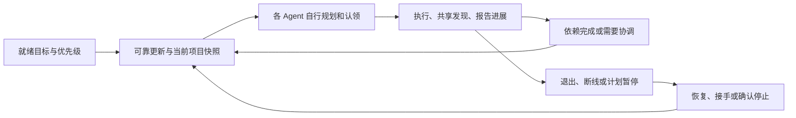

# 阶段 B 开发计划：计划同步与可靠推进

日期：2026-10-08。状态：首版已实现并验证；交付范围与相对计划的差异见[验收记录](../testing/reliable-progression-stage-b-2026-10-08.md)。基线：main `3c0c91e`（包含阶段 A `e886042`）。对应[v0.2 总体方案](autonomous-collaboration-v0.2.md)的阶段 B；当前协议见[开发说明](../development-guide.md#13-阶段-a项目管理与任务认领)。

## 1. 交付目标与范围

Preflight 继续用于替代传统 devboard。阶段 B 要让项目计划驱动 Agent 持续工作：人登记方向、优先级、边界与验收，Agent 自己拆任务、选择和认领、维护进展；依赖完成、计划变化或责任者失联时，工作可以继续推进，管理者无需逐步分派、提醒或维护另一块板。

第一版限定一个仓库、一个项目、两个独立 Agent、两个不同优先级目标、一个里程碑和至少一条跨目标依赖。两个 Agent 使用相同客户端实现、不同成员凭据和独立工作目录，没有固定前端/后端角色。服务器仍是共享 MCP 服务，客户端适配器负责启动/恢复所属 Agent、心跳与停止；不增加一个向其他 Agent 分派任务的主 Agent。

阶段 B 的闭环：

交付包括可靠更新、一个真实客户端适配器、运行状态、自动续租/恢复、计划控制同步、协商超时和管理视图。Git/CI 独立事实、贡献集成、目标整体验收、里程碑正式交付与完成任务重新打开属于阶段 C；本阶段不将 reported_completed 改名为已交付。

## 2. 阶段 A 基线缺口（首版已补核心路径）

| 当前实现 | 对阶段 B 的影响 | 必须补齐 |
| --- | --- | --- |
| `domain_events` 仅用于审计与最近动态 | 不能证明执行者收到或处理变化 | 独立更新事件、按接收方投递、确认与重试 |
| Session 由提出/认领任务创建，`last_seen_at` 记录部分操作 | 空闲 Agent 无法先订阅新目标；最近操作不等于活跃进程 | 开工前的 Session/运行实例登记、独立心跳和订阅 |
| 租约 10 分钟，靠主动调用续期 | 长模型调用期间可能无意失去责任 | 适配器后台续租与租约丢失后的执行限制 |
| 过期在读取时显示，接管时写事件 | 不会主动通知其他执行者 | 有界后台维护、一次性失效事件与可接手通知 |
| 协商必须等当前轮全体答复 | 缺席可能永久阻塞 | 持久 deadline、超时隔离、无假共识 |
| 暂停/取消仅限制服务端写入 | 外部 Agent 可能还在执行 | 送达、客户端收尾/停止、执行者逐一确认 |
| 已有测试主要用 SDK 脚本安排角色动作 | 证明协议，不能证明自主持续执行 | 真实模型、真实客户端、无任务分派/催办试验 |

## 3. 实施顺序与完成门槛

每一步先覆盖对应失败场景，再交付可运行结果；全部在 main 增量开发，沿用 Conventional Commits。下表是依赖顺序，不承诺固定工期。

| 步骤 | 工作与产物 | 完成门槛 |
| --- | --- | --- |
| B0：真实客户端探针 | 检查可用客户端及当前官方接口；记录启动、续接、事件边界、停止、错误和消耗指标能力 | 无私下消息提示，外部适配器能用持久会话标识触发下一轮；正在执行时可排队；能观察结束/失败并验证停止能力 |
| B1：Session 与可靠更新 | 新领域契约、增量迁移、事务内投递、读取/确认、订阅与仓库隔离测试 | 空闲 Session 能接收就绪目标；未确认更新在服务重建后仍存在，重复投递安全，越权确认被拒绝 |
| B2：运行实例与续租 | 适配器持久 journal、单 Session 串行执行、运行实例 fencing、独立心跳/续租、重试和恢复 | 长模型调用不丢租约；适配器重启先核对结果；同 Session 双实例只有一个获准推进共享状态；旧实例不能续租或上报，新实例接续前核实进程状态 |
| B3：计划和依赖接续 | Agent 循环、相关事件路由、依赖完成触发下一轮、暂停/取消/定义变化、执行确认 | 两个 Agent 依据同一计划自己认领；依赖完成后无需提醒；暂停状态区分已请求、已确认和未知 |
| B4：超时与管理视图 | deadline、后台维护、失联和积压、Goal/Milestone 风险来源、浏览器验证 | 缺席不算赞成；超时隔离有理由和证据；管理者能看出哪个任务/目标/里程碑受影响 |
| B5：真实试用与交付 | 至少三次正常模型试验及退出/重启/暂停异常试验，记录干预、成本与限制 | 每次报告成功/失败；通过案例没有人工任务分派或催办，工作台与执行记录一致，保留失败证据 |

B0 先做小探针，不先开发通用模型编排。不用当前对话中的“发送消息给另一个任务”冒充生产适配器，也不把 SDK 初始化或工具调用成功当作会话唤醒成功。

若客户端不支持恢复，只能交付轮询/新轮启动模式，并标明上下文重建与延迟；不得将该降级计作原会话恢复验收通过。可选其他具备可验证接口的客户端，或缩小已交付能力。接口选择和证据写入后续探针报告，本计划不预先认定某个客户端可行。

## 4. 服务端设计

### 4.1 新契约草案

下面为原设计接口；首版已提供三个可调用工具，实际字段见[开发说明第 14 节](../development-guide.md#14-阶段-b可靠更新与本地执行适配器)。业务 repo/member 一律由凭据推导；Session 与运行实例操作仅允许对应 Agent。所有输入有长度、数量和枚举上限。

| 入口 | 主要输入与输出 |
| --- | --- |
| `preflight_manage_session` | `operation=open/recover/heartbeat/close`；open 指定 project 和客户端能力，返回 Session、运行实例标识/epoch；recover 通过版本与过期条件原子接手；heartbeat/close 校验当前实例；写入带 request_id |
| `preflight_get_updates` | session_id、当前运行实例、limit、可选分页 cursor；返回未确认 delivery、事件引用和处理优先级；读取不确认处理成功 |
| `preflight_ack_updates` | session_id、当前实例、delivery IDs、request_id；记录处理结果和所依据实体版本；同身份重复确认返回原结果 |
| 现有 Claim/Progress/Review | 对接入适配器的 Session 校验当前运行实例；保留已有 lease/epoch、expected_version 和参与者约束 |
| Project/Context/Atlas | 增加运行状态、相关未处理更新、协商期限、停止确认和计划风险投影；限制数量，展示来源/时间与截断 |

manage_session 各 operation 使用明确的字段组合，open 不接受他人的 session_id，recover 不允许抢占仍有效的实例。单成员凭据不等于可以复用同 Session 的旧运行实例。旧手动调用和旧 Session 保留，标记为未接入适配器，不能被展示为已启用可靠推进。

新适配器 Session 绑定一个 Project，开工前即可创建并订阅。服务端把项目就绪目标、可认领任务变化路由给在线订阅者；后加入者先取当前完整快照，不能仅靠历史通知发现工作。

### 4.2 数据与事务

拟新增 `coordination_events`、`event_deliveries` 和 Session 运行实例记录；扩展 Decision 的 deadline/超时原因，以及计划停止确认记录。根据字段依赖添加 `004_reliable_updates.sql`、`005_runtime_and_timeouts.sql` 等版本迁移，不修改 001～003，不重写历史进度或共识来源。

- 事件包含 UUID、repo、project、类型、实体 ID/版本、优先级和精简摘要；delivery 指向接收 Session、事件、投递/确认时间、尝试次数与下一次重试时间。
- 业务修改、审计、事件与当前接收方 delivery 在同一事务写入。现有管理写入分布在 service/management，需抽出共用记录/事件入口，防止部分接口遗漏投递。
- `(event_id, receiver_session_id)` 唯一；幂等重放不再产生 delivery。更新读取单独调用，不修改原幂等 data 快照。
- 至少一次投递。客户端成功处理后确认；cursor 仅用于分页，不能代替确认。恢复查询覆盖全部未确认 delivery，不能靠递增序号跳过晚提交事件。
- ack 意味着变化已被核对并处理，不意味着任务完成。先持久化“已处理/已等待/已停止”和业务结果引用，再确认；处理失败保持未确认并按退避重试。
- 实体引用在处理时重新读取；事件可能过时，不能直接把旧事件内容当成当前计划。计划/定义的新版本优先，重复变化可以合并读取，但逐条 delivery 仍要有处理归属。

新 worker 有界扫描过期租约、失效运行实例、到期协商和待重试投递；不执行代码或启动模型。使用事务锁、当前状态/epoch 条件和唯一约束保证多 worker/重启不重复转移。现有租约校验继续即时生效，正确性不依赖 worker 准时运行。

### 4.3 事件路由

| 变化 | 接收者与行动 |
| --- | --- |
| 目标就绪、优先级/日期/里程碑改变 | 当前项目订阅者刷新计划；自行选择工作，不接收管理员分派指令 |
| 目标暂停/取消/归档、定义改变、项目归档 | 当前责任者及参与执行者优先处理，收尾/停止或重新规划；记录相应计划版本 |
| 任务提出、释放、租约失效 | 项目订阅者检查任务池；任务过期只通知可接手，不替 Agent 强行分配 |
| 上游任务完成或定义失效 | 直接下游的参与者及项目内候选执行者重新核对依赖，符合条件才认领 |
| 相关 Findings 发布/反驳 | 同目标、直接依赖或明确相关的活跃 Session 读取知识，不向全仓库无差别广播 |
| 共同议题待答复、结论或超时 | 受影响工作参与者/责任者读取当前轮，审议或隔离；不能伪造缺席者答复 |

业务责任 owner 不因运行者失联而改变。可靠更新投递失败与代码执行失败分别记录；服务端可观察“未确认/租约失效”，不能只凭网络不通断言外部进程已退出。

## 5. 客户端适配器

### 5.1 最小运行循环

适配器首次启动登记项目 Session、读取快照并触发一次有限预算的工作发现。Agent 先看就绪目标、优先级、已有任务与历史知识；已有适当任务就认领，缺少任务才提出，普通工程决定在目标边界内自行处理。

适配器随后轮询更新，按 Session 串行执行。运行中的更新排队并合并：客户端有可验证的工具边界注入能力时在边界提供；否则在下一轮注入，显示实际延迟。没有就绪工作就等待，不重复启动模型让它回答“暂无任务”。

工作目录采用独立 worktree。初始化目录属于基础设施，不为 Agent 指定前端/后端角色。Adapter 配置客户端命令、允许项目/目录、凭据引用、轮次/时间/费用预算；不通过服务端执行上传命令，也不将共享记录中的文本作为宿主进程命令。

### 5.2 心跳、去重和崩溃恢复

- 心跳和续租由独立循环执行，不依赖模型记得调用。服务端返回失效/接管后，旧实例停止新的写入与执行动作，不自动夺回责任。
- 本地持久 journal 保存实例标识、客户端会话 ID、event/delivery、稳定 request_id、处理中/已完成结果引用；不保存凭据明文、完整 prompt 或思维链。该目录纳入 Git ignore。
- 恢复时先检查是否仍有运行中的客户端进程、当前 Session 实例与租约，避免同一 turn 被启动两次。进程身份采用客户端句柄/持久运行标识，不仅凭一个可能复用的 PID。
- “业务完成但 ack 前崩溃”：读取实际业务版本/原 request_id 结果后确认，不再执行同一操作。“模型启动但状态未知”：先查询或恢复原会话；不能直接新开会话并重做。
- 本地去重只是辅助。外部操作结果无法确认时标为结果未知，重新读取并处理；不得承诺严格一次执行。阶段 B 不新增自动 Git 集成功能。
- 同一 Session 最多一个执行 turn；第二适配器仅在原实例过期或明确退出后恢复，增加 runtime epoch。版本/运行实例 fencing 与任务 lease fencing 同时校验。

运行实例 fencing 限制 Preflight 共享状态写入，不是本地文件锁。旧进程是否停止须由客户端能力与进程观察确认；原进程状态未知时不能在同一工作目录重复启动。无法安全续接则保留未知状态，使用隔离目录进行明确的接管流程，旧成果仅作为候选记录，不冒充已被清除或已完成。

### 5.3 暂停和预算

管理者暂停/取消计划后，服务端立即限制新认领和进度推进；适配器停止新动作，在支持的安全边界收尾或停止子进程，记录执行确认。所有仍相关的执行者均需确认。未送达、失联或无法核实进程状态显示“停止待确认/状态未知”，不能把 ack 当成进程停止的证据。

恢复只在当前计划仍就绪、定义一致、租约有效且预算未耗尽时执行。预算耗尽记录原因并停止自动启动，不转成“需要你选择技术方案”。可配置费用上限只在客户端能可靠提供费用时生效；不能获取时明确缺失，用轮次、用时和重试上限兜底。

## 6. 协商超时与管理视图

### 6.1 超时规则

创建/换轮时持久化 deadline。建议首版每轮 10 分钟，可配置；换轮基于当前事务确定期限。worker 或相关写操作检查过期，晚到答复不能覆盖已生效超时结果。

到期未全体答复进入 deferred，原因 unanswered_timeout；三轮分歧原因 disagreement_limit，两者分别展示。缺席不算接受，不自动删掉受影响工作，不转人工技术裁决。无法安全隔离时仍保持未报告完成，Agent 可重规划或等待依赖。

受管理任务的正式逐工作审议需当前责任租约；同伴调查/建议通过 Findings 保留。活动协商中的责任接管使旧责任者意见需新责任者重新确认，历史意见保留，相关 epoch 与去重约束一致更新；接管/重试不能无限延长既有 deadline。已完成的历史共识不会仅因责任者离线改写。

### 6.2 工作台要回答的问题

| 管理问题 | 展示内容 |
| --- | --- |
| 为什么没继续？ | 等待依赖、待协商、租约过期、运行者未响应、未确认计划变化、预算耗尽或执行失败 |
| 暂停生效了吗？ | 计划版本、停止请求时间、各执行者确认与尚未确认者，不用一个绿色状态概括全部 |
| 影响哪个计划？ | 阻塞任务 → 所属 Goal → Milestone；跨目标直接依赖也可追溯 |
| 更新有没有送到？ | 最老未确认更新的等待时间、待处理数量、最近处理结果；不将审计动态当成送达证明 |
| 是否真的交付？ | 保持已报告完成/待独立验收；阶段 B 不生成 Git/CI 已验证状态 |

延期风险只记录可追溯的事实与原因，例如日期已过且未完成、关键依赖未就绪、长时间无确认；不根据完成百分比自动推算可信 ETA。初版支持阶段/阻塞/运行状态筛选，不建立完整聊天或资源排期系统。

## 7. 建议初始配置

以下为开发起点，不是当前已生效配置；B0 后可根据客户端实际耗时调整。

| 项目 | 初始建议 |
| --- | --- |
| 更新轮询 | 活跃 5 秒；空闲逐步退避到 30 秒，带抖动 |
| 单次更新数 | 20，最大 50；摘要与上下文有字节上限，截断可继续读 |
| Session 心跳/实例失效 | 30 秒一次，连续 120 秒无心跳标为未响应；与任务租约到期分别展示 |
| 租约/续期 | 保持 10 分钟租约，每 2 分钟续期；续期失败停止新增动作并核对归属 |
| 后台维护 | 5 秒一次有界批次；请求路径也校验 deadline 与租约 |
| 协商每轮 | 10 分钟，三轮上限保留；真实客户端超时按配置记录 |
| 执行容量 | 每 Session 一个 turn、一个主任务；两个 Session 初始最多两个主任务，服务器/适配器共同校验 |
| 预算 | 按运行配置轮次、用时、重试次数；客户端可提供费用时再启用费用上限 |

业务优先级决定任务发现排序，不禁止为了完成高优先级目标的前置依赖而处理其他目标。低优先级工作需在高优先级不可执行或有余量时选择，并保留依据；不在服务端实现通用调度优化器。

## 8. 验收与可审阅提交

### 8.1 确定性测试

真实 PostgreSQL/HTTP/MCP 与独立进程覆盖：业务/投递事务原子性；未确认分页；读后未 ack 的重投；服务与适配器重启；ack 后不重做；晚提交不丢事件；跨仓库/成员越权；双实例接手与旧 epoch 拒绝；长调用心跳；错误续租；依赖事件重新核对；暂停未确认；超时与答复/接管竞争；多 worker 一次性状态转移。

时钟注入用于覆盖期限竞态；至少一个真实进程续租/重启场景按实际时间运行。客户端假实现仅用于故障注入，不计真实模型验收。继续运行阶段 A 和原协商回归，新增真实 Chromium 的风险/确认状态验证。

### 8.2 模型试验

固定一个小型 fixture 项目、两个业务目标和里程碑；需求预先给出客观验收条件，不预设任务分工。两个客户端各自读取共享计划，自行创建/选择任务、认领、发布事实和处理相关更新。选取至少一个上游成果能通过共享 Findings/候选提交引用被下游实际复用的案例，不由测试器偷偷搬运或提示下一步。

至少三次正常运行，另做退出接手、适配器重启和暂停测试。初始化进程/凭据/工作目录与提供业务需求可人工完成；任务分派、催办、普通技术确认单独计数，通过案例均为 0。人故意修改业务计划是控制场景输入，不能统计成完全无人输入。

记录真实提交与本地测试结果，但本阶段不要求产品生成共同集成版本的独立验收；该门槛保留到 C。每次记录工作耗时、调用/轮次、token/费用（缺失明确写缺失）、积压、接手与干预、成功/失败原因。模型不配合或无法安全恢复时保留失败，不以脚本执行替代模型结果。

### 8.3 提交划分

建议按 B0～B5 分批提交，避免最后一次提交覆盖全部复杂行为：

1. `docs(adapter): record client capability probe`：实际能力与证据、选型和限制。
2. `feat(events): add durable session updates`：Session 开工前登记、订阅、投递/确认与数据库验证。
3. `feat(adapter): add leased agent runtime`：journal、实例 fencing、真实客户端启动/恢复、心跳/续租。
4. `feat(project): synchronize plan changes and dependencies`：发现循环、计划版本、依赖接续与停止确认。
5. `feat(coordination): bound missing reviews and expose risks`：期限、后台维护和工作台风险。
6. `test(adapter): verify autonomous progression and recovery`：重复真实试用、失败记录、文档与接入说明。

如中间提交尚未形成闭环，只标对应能力已完成。B 的完成条件同时包含真实客户端推进和项目管理视图；阶段 C 仍单独验收。
