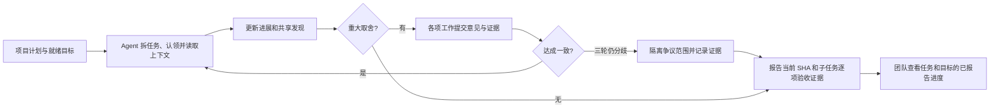

# Preflight 产品说明

> Air traffic control for coding agents.
>
> 当前实现：0.1.0 团队 MCP MVP + v0.2 阶段 A 首版。更新日期：2026-10-08。
> 实现与接入见[开发说明](development-guide.md)，启动见[README](../README.md)。

## 1. 产品定位

Preflight 是面向 AI 编程团队、以共享 MCP 服务器为核心的项目管理产品，为替代传统开发看板（devboard）而生。产品目标覆盖需求与待办、目标优先级、任务与责任、依赖、里程碑、进度、验收和交付；Agent 围绕计划开展工作、维护进展、共享发现，并在目标边界内自行协商和验证。

自主协作是支撑项目管理的执行内核。人管理业务方向、优先级和交付承诺，也可以授权 Agent 在明确边界内维护计划；日常任务拆解、状态同步和工程协调由 Agent 承担。管理者应能直接理解项目进展与风险，减少额外维护第二块看板的成本。上述完整管理能力是产品目标，当前已实现范围以第 7 节为准。

MCP 是 Agent 的主要入口，Web 工作台是人的入口。信息必须对同仓库的其他成员可见，并在进程重启后保留，产品价值不能只体现在单个用户或单次对话中。

Git/GitHub/GitLab 继续负责代码、提交、评审和合并；CI 继续执行验证。Preflight 承接“要做什么、先做什么、谁负责、做到哪里、为什么卡住、影响什么计划、什么已经交付”的项目管理与协作记录。

## 2. 解决的痛点与价值假设

| 痛点 | MVP 的对应能力 | 需要试用验证的价值 |
| --- | --- | --- |
| 看板靠人手更新，Agent 工作细节散落在对话中 | Agent 通过 MCP 更新共享 Change；工作台展示状态 | 减少手动整理进展和追问“做到哪了” |
| 多人、多 Agent 重复调查同一问题 | 提示相关工作，发布和读取 Findings | 减少重复投入，复用已经验证的发现 |
| 工程取舍在聊天中反复讨论 | 关联多个 Change 的协商、证据与一致结果 | 减少人工介入与不同 Agent 的行为假设不一致 |
| 只看到“完成”，无法对应用户需求 | 每个 Goal 带验收条件，完成需提交 SHA 和逐项证据 | 让交付回到明确目标和可检查的结果 |
| 单人插件无法表达团队共同状态 | 共享服务器、仓库隔离、持久化和成员身份 | 同一团队看到同一份协调记录 |

这个方向具备实现可行性。前景取决于是否能进入真实团队的日常工作并持续节省协调成本。MCP 接口本身不足以形成竞争优势；可持续价值应来自跨 Agent 的协作数据、可靠证据、低维护成本和对现有开发工具的兼容。当前没有团队试用数据，不把市场需求和留存作为已验证结论。

## 3. 首批用户与最小范围

首批试用对象：一个仓库、2～4 名成员、至少两个独立 Agent 客户端，使用同一个部署。人类可以先在工作台登记目标，也可以让 Agent 将明确的用户请求登记为目标。

第一版应覆盖从需求到报告完成的协作闭环，因此包含 Goal、Change、Findings、Decision 和验收记录。只展示文件重叠或活跃 Session，无法验证替代 devboard 的主要价值。

当前版本采用主动 MCP 上报。接入后仍需给 Agent 明确工作约定，不能保证任意 Agent 自动调用工具。尚不能观察未接入的 Agent，也不能在 Agent 不上报时自动更新进展。

## 4. 产品原则

1. **Agent 主动维护记录并自行协调。** 日常分歧依照目标、已有约束、各项工作意见和验证证据解决；仅缺少必要目标信息或必须改变目标边界时请求补充。
2. **区分报告与事实。** 当前声明范围、进度和验证标记为 `agent_report`；未来 Git/CI 事实接入后应独立存储与展示。
3. **相似提示不能替代身份判断。** 相关工作有解释证据；不会因为标题相似就合并 Change 或阻止别人工作。共享同一 Change 必须显式加入。
4. **协商结论必须回到工作上下文。** 每项受影响工作都有明确答复和证据，一致结果在相关 Agent 下次读取上下文时返回。
5. **重试不能重复创建工作。** 同一写操作重试复用 `request_id`，进度更新与协商答复检查版本。
6. **服务故障不接管开发环境。** 服务不可用时明确返回错误，Agent 可继续正常开发；服务不执行 Git 写操作或运行上传的命令。
7. **少存必要信息。** 存摘要、结构化 Findings 和验收证据，不设计原始 Prompt、思维链、源码或完整 diff 上传入口。常见凭据会脱敏，使用者仍须避免发送敏感内容。

## 5. 核心对象

| 对象 | 含义与关系 |
| --- | --- |
| Project | 仓库内的项目管理边界，含目标/边界、状态和明确的规划授权 |
| Milestone | 项目内的计划节点，组织目标和日期；汇总已报告进度，尚不能正式交付 |
| Goal | 用户希望达成的结果与验收条件；没有工作时显示待开始 |
| Session | 某成员的 Agent 工作参与身份；只能由所属成员使用 |
| Change | 围绕一个 Goal 的工作单元，拥有阶段、版本、声明范围和验证记录 |
| Findings | 工作中的观察、假设、根因、约束或测试结果；含置信度，可进入相关工作上下文 |
| Decision | 一项协商议题；带选项、取舍、影响范围、逐工作答复、证据和协商结果 |
| Event | 谁在何时做了什么，供团队动态与追溯使用 |

一个 Project 可以有多个 Goal，可将目标排入 Milestone。Goal 含需求/缺陷类型、优先级、业务责任人、计划日期和定义版本。一个 Goal 可拆为多个 Change，任务含独立验收、目标条件映射和依赖。同项目可跨 Goal 依赖。一个 Change 可以被多个 Session 参与，但同一时刻只有一份有效主责任租约。新任务按自己的条件验收，映射表示贡献，不证明目标已独立验证。旧模式工作保留原验收和历史来源。

## 6. 最小闭环

例子：Alice 的 Agent 调查登录超时，发布根因发现；Bob 的 Agent 开始处理同仓库相关工作，获得重叠声明文件和错误指纹的提示，并读取 Alice 的发现。两项工作需要确认同一个公共错误格式，提出关联两项工作的协商议题。两个 Agent 对照目标中的兼容要求，分别提交保持兼容的意见和验证证据；系统记录一致，双方下次读取上下文得到同一结果，完成实现后报告测试结果与验收证据。

`blocking` 表示不能把受影响的工作报告为完成，不实施文件锁，也不禁止继续处理不受影响的部分。Agent 应根据协商状态提交意见、验证替代方案或隔离争议范围。不会将无关决策全局传播为阻塞。

## 7. 当前功能边界

### 已实现

- 项目与简单里程碑；需求/缺陷待办、就绪、暂停、取消、归档；优先级、业务责任人、计划日期、版本与审计。
- 人或明确授权的 Agent 维护规划，执行 Agent 自行提出任务、认领、续期和释放；10 分钟租约过期可接管，旧责任者不能覆盖新进度。
- 子任务独立验收、定义版本与覆盖缺口、同项目跨目标依赖及环检测、按优先级排序的可认领任务。
- 工作台创建/编辑项目、里程碑、目标和未认领任务；列表/看板、计划筛选、依赖阻塞与执行责任；修改已认领任务定义需当前租约。
- 历史 Findings 检索、游标分页、失败尝试的适用条件/证据、反驳与替代引用；完成后的知识保留。
- 带仓库与成员身份的 HTTP MCP：查询项目、登记目标、开工、读取上下文、报告进展、发布发现、提出协商及提交意见。
- 基于同 Goal、标题、声明路径、错误指纹的确定性相关提示，含分数、证据和关系反馈。
- PostgreSQL 持久化，读快照、事务内审计、幂等响应与版本校验。
- Agent 协商协议：每项受影响工作答复，一致后自动完成；最多三轮，分歧后记录隔离建议。完全相同且影响范围有交集的提案可复用，不做语义改写。
- Web 工作台：人类登录、登记目标、查看状态与验收、筛选工作、协商过程与结果、最近动态、10 秒轮询；显式选择 Change 或全仓库读取 Findings，显示来源、置信度与截断提醒。
- 常见凭据脱敏、仓库隔离、参与成员校验、过期/撤销令牌、同源限制。

### 尚未实现

- Git/worktree Observer、实际文件变更/合并冲突识别、Git Provider 和 CI 同步。
- 从用户对话自动抽取目标、自动接管未配置的 Agent、被动状态捕获。
- 语义/Embedding 检索、长期 Policy、Context token 预算、知识质量自动判断。
- 独立目标/里程碑验收、正式交付/发布、已完成任务重新打开、执行容量限制与自动调度。
- 客户端可靠唤醒、自动心跳/恢复、协商缺席超时；当前需客户端主动读取并续租。
- SSE/推送、OAuth/组织管理、细粒度授权、多实例浏览器会话和规模化运行。
- 自动合并、执行代码、调度或控制其他 Agent。

当前可以试用小团队的项目计划、任务依赖与责任、进展、共享知识和工程协商管理。要替代完整 devboard，还需要可靠自动推进、独立验收与交付闭环，以及真实项目持续试用。

## 8. 状态与可信度

Change 阶段：`probable → implementing → verifying → completed`，活动工作可 `abandoned`，验证中可以回到实现阶段。初始 `probable` 在当前版本表示 Agent 已登记、准备开展，来源仍是报告，不表示后台自动观察到了开发。

Goal 计划状态与执行汇总分开：计划含待办、就绪、暂停、取消、归档；执行汇总含待开始、进行中、协商中、已报告完成。就绪目标的全部任务报告完成、当前定义版本验收映射完整、没有依赖/重规划阻塞，才汇总为已报告完成；取消/放弃不计入完成。仍无已完成任务重新打开和正式交付入口。

暂停/取消阻止新认领和服务端阶段推进，不能终止外部 Agent 进程。业务责任人与租约持有人分别展示；失联不会自动更换业务责任人。优先级决定发现顺序，当前不强制限制并行数量。

报告完成要求：没有尚在协商或缺少目标信息的阻塞项；达到上限的争议项必须有逐项隔离/降级证据，不能伪装成已达成共识；当前输入提供格式正确的提交 SHA、通过的验证结果，以及覆盖每条验收条件的通过记录和说明。服务器校验记录完整性，**不会执行测试、检查 SHA 是否属于远程仓库或证明 Agent 的陈述属实**。

## 9. 首轮验收与试用

工程验收必须覆盖两个独立客户端共同工作，而非仅验证单个工具能调用：

- 两个 Agent 能发现同一个目标，保留独立工作身份，并共享相关 Findings。
- 重试不产生重复记录，越权成员不能写入别人的 Session，其他仓库不可见。
- 两个 Agent 各自提交证据并达成一致后，结果进入两个上下文，解决一个议题不会清除其他阻塞。
- 未解决阻塞或缺少逐项证据不能报告完成；已报告完成在工作台可见。
- 服务对象重建后记录仍存在；人类可以在真实浏览器登记目标、查看协商和退出。

当前自动化测试覆盖以上闭环。真实试用建议持续两周，记录是否复用了他人的 Findings、是否减少了手动状态更新、同一议题是否形成可复用的一致结论，以及成员是否愿意继续使用。优先比较接入前后的协调耗时、重复调查实例和协商耗时与人工介入次数；不以工具调用次数代替价值。

如果 Agent 上报成本过高，优先改集成体验；如果状态经常失真，优先接入 Git/CI 事实；如果团队仍必须维护第二块看板，识别缺失的计划/验收功能，再决定扩展范围。

## 10. 自主协商边界

普通议题使用 `within_goal` 权限范围，由受影响工作的参与 Agent 自行答复。每轮只能答复一次；全体接受同一选项自动记录 `agent_resolved`。异议或不同选项进入下一轮，最多三轮，之后 `deferred`，要求隔离争议范围。新增影响工作会开启新的审议周期，使旧范围的答复失效。

只有明确标为目标边界变化或缺少必要信息的议题进入 `needs_input`；不会把普通协商失败自动变成人工待办。工作台以只读协作进展为主，不提供普通人工裁决表单。`human_resolved` 仅保留旧记录或确需用户输入的例外。

协议是协调记录和完整性检查。服务器不运行模型、测试或后台调度；证据内容由 Agent 上报，实际开发与持续读取仍依赖外部 Agent 接入。

## 11. 演进与原稿处理

原四份文档中的 Observer-first、文件冲突、Claim、Policy 和模型能力保留为长期候选路线。用户明确了 MCP 服务器与替代 devboard 的目标后，交付顺序调整为先验证共享闭环，再补事实捕获和高级协调；原来的 Phase 0～3 不再作为当前 MVP 的交付门槛。

原文保持在 [archive](archive/)：产品稿、旧技术稿、v1.1 技术稿、开发指南。当前产品约束以本文为准，协议与代码行为以[开发说明](development-guide.md)及实现为准。

## 12. v0.2 后续目标（阶段 A 首版已实现，B/C 待开发）

[v0.2 改造方案](plans/autonomous-collaboration-v0.2.md)将项目管理与自主协作共同作为交付范围。首版已具备基础计划、任务/依赖、认领和报告汇总；后续继续完成：

- 客户端自动维护心跳、可靠更新消费、断线恢复和协商超时。
- 执行容量约束、返工与重新打开、标签/搜索和更完整的管理筛选。
- 按目标和里程碑汇总进度，显示阻塞原因、验收覆盖缺口与影响；不以任务数量代替需求完成情况。
- 从已报告完成到验证、集成和里程碑交付的证据链，分别展示发布/部署状态。

这些管理能力从第一阶段开始实现，不能等自主协作内核做完后再补。项目管理 MCP 与工作台共享领域规则，Agent 更新执行状态后自动反映在管理视图中。提供可选人工计划编辑，不要求人审批每项普通工程取舍。

验收必须同时证明团队可以在 Preflight 管理一个项目，和 Agent 能围绕同一计划自主执行。只有协作工具运行正常、却仍需维护另一块 devboard，不能视为替代目标达成。
