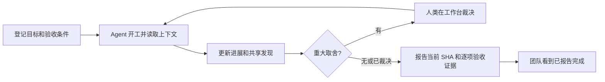

# Preflight 产品说明

> Air traffic control for coding agents.
>
> 当前实现：0.1.0 团队 MCP MVP。更新日期：2026-10-04。
> 实现与接入见[开发说明](development-guide.md)，启动见[README](../README.md)。

## 1. 产品定位

Preflight 是面向 AI 编程团队的共享 MCP 服务器，目标是逐步替代传统开发看板（devboard）的日常开发协调：目标进入共享记录，Agent 围绕目标开展工作、更新进展、共享发现；人类集中处理重要取舍并查看交付证据。

MCP 是 Agent 的主要入口，Web 工作台是人的入口。信息必须对同仓库的其他成员可见，并在进程重启后保留，产品价值不能只体现在单个用户或单次对话中。

Git/GitHub/GitLab 继续负责代码、提交、评审和合并；CI 继续执行验证。Preflight 承接“要做什么、谁正在做、有哪些发现、什么需要决定、是否报告通过验收”的协作记录。

## 2. 解决的痛点与价值假设

| 痛点 | MVP 的对应能力 | 需要试用验证的价值 |
| --- | --- | --- |
| 看板靠人手更新，Agent 工作细节散落在对话中 | Agent 通过 MCP 更新共享 Change；工作台展示状态 | 减少手动整理进展和追问“做到哪了” |
| 多人、多 Agent 重复调查同一问题 | 提示相关工作，发布和读取 Findings | 减少重复投入，复用已经验证的发现 |
| 工程取舍在聊天中反复讨论 | 关联多个 Change 的决策与一次人类裁决 | 减少同一问题被重复询问及答案不一致 |
| 只看到“完成”，无法对应用户需求 | 每个 Goal 带验收条件，完成需提交 SHA 和逐项证据 | 让交付回到明确目标和可检查的结果 |
| 单人插件无法表达团队共同状态 | 共享服务器、仓库隔离、持久化和成员身份 | 同一团队看到同一份协调记录 |

这个方向具备实现可行性。前景取决于是否能进入真实团队的日常工作并持续节省协调成本。MCP 接口本身不足以形成竞争优势；可持续价值应来自跨 Agent 的协作数据、可靠证据、低维护成本和对现有开发工具的兼容。当前没有团队试用数据，不把市场需求和留存作为已验证结论。

## 3. 首批用户与最小范围

首批试用对象：一个仓库、2～4 名成员、至少两个独立 Agent 客户端，使用同一个部署。人类可以先在工作台登记目标，也可以让 Agent 将明确的用户请求登记为目标。

第一版应覆盖从需求到报告完成的协作闭环，因此包含 Goal、Change、Findings、Decision 和验收记录。只展示文件重叠或活跃 Session，无法验证替代 devboard 的主要价值。

当前版本采用主动 MCP 上报。接入后仍需给 Agent 明确工作约定，不能保证任意 Agent 自动调用工具。尚不能观察未接入的 Agent，也不能在 Agent 不上报时自动更新进展。

## 4. 产品原则

1. **Agent 主动维护记录，重要裁决留给人。** 日常状态由工具调用更新；公共接口、安全、数据结构和产品行为等重大取舍进入决策队列。
2. **区分报告与事实。** 当前声明范围、进度和验证标记为 `agent_report`；未来 Git/CI 事实接入后应独立存储与展示。
3. **相似提示不能替代身份判断。** 相关工作有解释证据；不会因为标题相似就合并 Change 或阻止别人工作。共享同一 Change 必须显式加入。
4. **裁决必须回到工作上下文。** 一次裁决可影响多个 Change，每个参与 Agent 在下次读取上下文时收到结果。
5. **重试不能重复创建工作。** 同一写操作重试复用 `request_id`，进度更新与裁决检查版本。
6. **服务故障不接管开发环境。** 服务不可用时明确返回错误，Agent 可继续正常开发；服务不执行 Git 写操作或运行上传的命令。
7. **少存必要信息。** 存摘要、结构化 Findings 和验收证据，不设计原始 Prompt、思维链、源码或完整 diff 上传入口。常见凭据会脱敏，使用者仍须避免发送敏感内容。

## 5. 核心对象

| 对象 | 含义与关系 |
| --- | --- |
| Goal | 用户希望达成的结果与验收条件；没有工作时显示待开始 |
| Session | 某成员的 Agent 工作参与身份；只能由所属成员使用 |
| Change | 围绕一个 Goal 的工作单元，拥有阶段、版本、声明范围和验证记录 |
| Findings | 工作中的观察、假设、根因、约束或测试结果；含置信度，可进入相关工作上下文 |
| Decision | 一项待人类裁决的重大取舍；带选项、收益、代价、建议和影响范围 |
| Event | 谁在何时做了什么，供团队动态与追溯使用 |

一个 Goal 可以有多个 Change，一个 Change 可以被多个 Session 显式参与，一个 Session 可以参与多个 Change。一个 Decision 可以关联多个 Change。当前每个 Change 报告完成时都要覆盖所属 Goal 的全部验收条件；跨子任务分配验收条件尚未实现。

## 6. 最小闭环

例子：Alice 的 Agent 调查登录超时，发布根因发现；Bob 的 Agent 开始处理同仓库相关工作，获得重叠声明文件和错误指纹的提示，并读取 Alice 的发现。两项工作需要确认同一个公共错误格式，提出关联两项工作的阻塞决策。负责人在工作台选择保持兼容并说明原因；两个 Agent 下次读取上下文得到同一裁决，完成实现后报告测试结果与验收证据。

`blocking` 表示不能把受影响的工作报告为完成，不实施文件锁，也不禁止继续处理不受影响的部分。Agent 应根据上下文决定等待或调整工作。不会将无关决策全局传播为阻塞。

## 7. 当前功能边界

### 已实现

- 带仓库与成员身份的 HTTP MCP：查询项目、登记目标、开工、读取上下文、报告进展、发布发现、提出决策。
- 基于同 Goal、标题、声明路径、错误指纹的确定性相关提示，含分数、证据和关系反馈。
- PostgreSQL 持久化，读快照、事务内审计、幂等响应与版本校验。
- 人类专用裁决接口；完全相同且影响范围有交集的待定提案可复用同一决策，不做语义改写。
- Web 工作台：人类登录、登记目标、查看状态与验收、筛选工作、裁决、最近动态、10 秒轮询；显式选择 Change 或全仓库读取 Findings，显示来源、置信度与截断提醒。
- 常见凭据脱敏、仓库隔离、参与成员校验、过期/撤销令牌、同源限制。

### 尚未实现

- Git/worktree Observer、实际文件变更/合并冲突识别、Git Provider 和 CI 同步。
- 从用户对话自动抽取目标、自动接管未配置的 Agent、被动状态捕获。
- 语义/Embedding 检索、长期 Policy、历史知识库、Context token 预算。
- 人类验收/拒绝/重新打开流程、目标优先级/负责人/里程碑、子任务验收分配。
- SSE/推送、OAuth/组织管理、细粒度授权、多实例浏览器会话和规模化运行。
- 自动合并、执行代码、调度或控制其他 Agent。

因此当前可替代的是小团队目标、进展、发现和工程裁决的记录流程。要替代完整项目管理，还需要计划管理和正式验收能力；试用中应据实际需求决定优先顺序。

## 8. 状态与可信度

Change 阶段：`probable → implementing → verifying → completed`，活动工作可 `abandoned`，验证中可以回到实现阶段。初始 `probable` 在当前版本表示 Agent 已登记、准备开展，来源仍是报告，不表示后台自动观察到了开发。

Goal 状态从工作汇总：待开始、进行中、等待决策、已报告完成。所有关联 Change 报告完成才显示目标已报告完成；放弃的工作不会被计入完成。没有目标归档、重新打开或终态修改入口。

报告完成要求：没有关联的待定阻塞决策；当前输入提供格式正确的提交 SHA、通过的验证结果，以及覆盖每条验收条件的通过记录和说明。服务器校验记录完整性，**不会执行测试、检查 SHA 是否属于远程仓库或证明 Agent 的陈述属实**。

## 9. 首轮验收与试用

工程验收必须覆盖两个独立客户端共同工作，而非仅验证单个工具能调用：

- 两个 Agent 能发现同一个目标，保留独立工作身份，并共享相关 Findings。
- 重试不产生重复记录，越权成员不能写入别人的 Session，其他仓库不可见。
- 共享决策由人类解决后进入两个上下文，解决一个决策不会清除其他阻塞。
- 未解决阻塞或缺少逐项证据不能报告完成；已报告完成在工作台可见。
- 服务对象重建后记录仍存在；人类可以在真实浏览器登记目标、裁决和退出。

当前自动化测试覆盖以上闭环。真实试用建议持续两周，记录是否复用了他人的 Findings、是否减少了手动状态更新、同一问题是否只裁决一次，以及成员是否愿意继续使用。优先比较接入前后的协调耗时、重复调查实例和决策等待时间；不以工具调用次数代替价值。

如果 Agent 上报成本过高，优先改集成体验；如果状态经常失真，优先接入 Git/CI 事实；如果团队仍必须维护第二块看板，识别缺失的计划/验收功能，再决定扩展范围。

## 10. 演进与原稿处理

原四份文档中的 Observer-first、文件冲突、Claim、Policy 和模型能力保留为长期候选路线。用户明确了 MCP 服务器与替代 devboard 的目标后，交付顺序调整为先验证共享闭环，再补事实捕获和高级协调；原来的 Phase 0～3 不再作为当前 MVP 的交付门槛。

原文保持在 [archive](archive/)：产品稿、旧技术稿、v1.1 技术稿、开发指南。当前产品约束以本文为准，协议与代码行为以[开发说明](development-guide.md)及实现为准。
